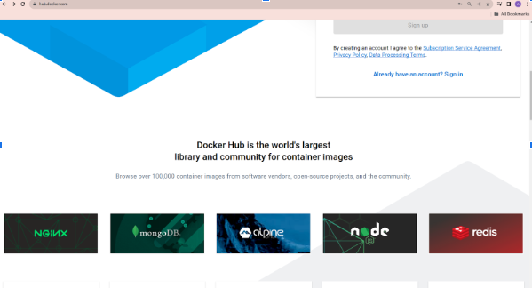
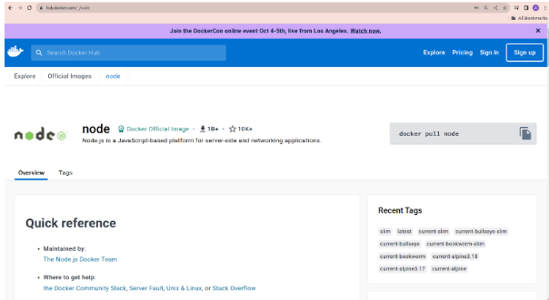
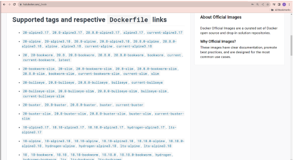
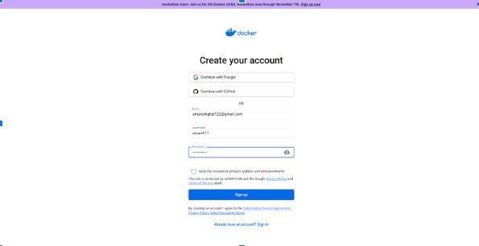
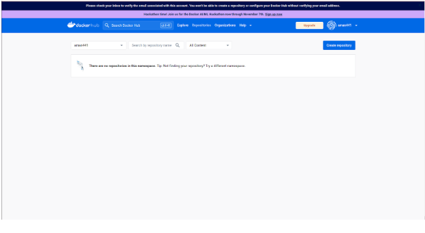
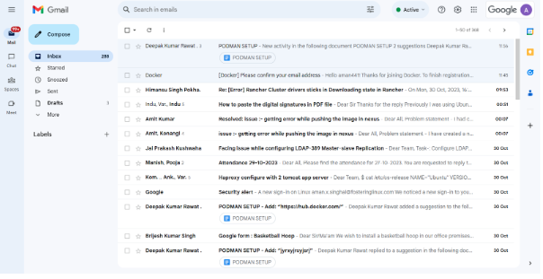
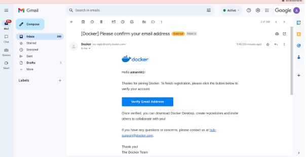
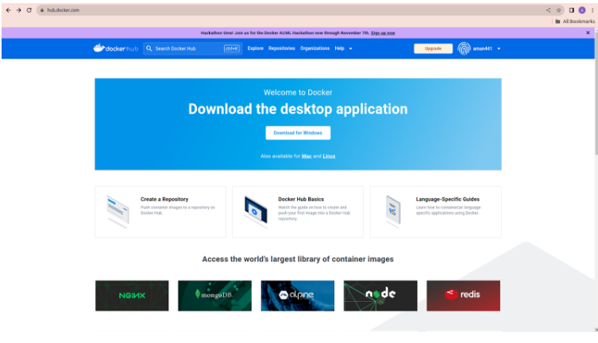
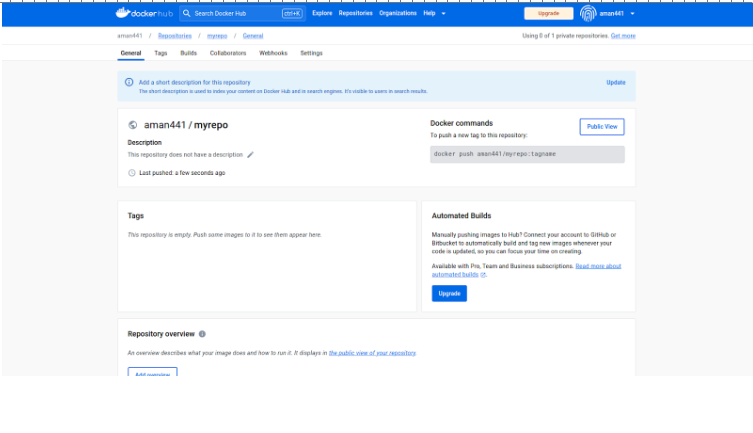
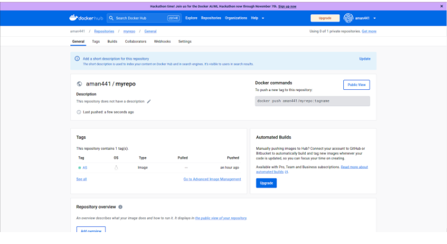

# PODMAN

## Ques1 -What is a container, and how does it differ from a virtual machine?

A container is a lightweight, standalone, and executable software package that includes everything needed to run a piece of software, including the code, runtime, system tools, libraries, and settings. Containers are a way to package and isolate applications so they can be easily deployed and run consistently across different computing environments.

Container is an advanced version of a virtual machine, if we talk about a virtual machine it needs some things to run like - Ram of the system, operating system etc. but in the case of a container we do not need anything of this.


## Ques2 -Explain the concept of containerization and its benefits in software development.


Containerization is a software development and deployment concept that involves packaging an application and its dependencies together into a single container image. This container image is a lightweight, standalone, and executable package that can run consistently across different environments, such as development, testing, staging, and production. Containers isolate applications and their environments, ensuring that they run consistently regardless of the host system.

Containerization is a powerful approach in software development that enhances portability, consistency, resource efficiency, and scalability of applications. It simplifies application management and deployment, making it a key enabler for modern software development practices like DevOps and microservices architecture.

### Benefits of containerization are given below :- 

### 1.Isolation and Portability:

Isolation: Containers encapsulate applications and their dependencies, providing isolation from the underlying system. This ensures that applications run consistently across different environments.

Portability: Containers can run on any system that supports containerization, making it easy to move applications between development, testing, and production environments.

### 2.Resource Efficiency:
Containers share the host OS kernel, which reduces resource overhead compared to virtual machines. They use fewer resources and can be started and stopped quickly.

### 3.Consistency:

Containers ensure consistency between development, testing, and production environments. The exact same container that is developed and tested can be run in production, reducing the chances of "it works on my machine" issues.

### 4.Rapid Deployment:

Containers can be started or stopped quickly, allowing for rapid deployment of applications. This agility is crucial in modern, fast-paced development and deployment pipelines.

### 5.Security:

They help prevent conflicts between different applications running on the same system and provide a level of protection against certain types of attacks.

### 6.Resource Utilisation:

Containers allow for efficient use of resources as multiple containers can run on a single host, each with its isolated environment. This leads to better utilisation of hardware resources.


## Ques3 -What is Podman, and how does it relate to container management?
Podman is a containerization tool that provides an alternative to Docker for running and managing containers. It is designed to be a drop-in replacement for Docker but with some unique features and differences. 

Container Management: Podman supports container management tasks, including creating and running containers, building container images, managing container networks, and handling container storage. It can also interact with container registries for image management.


## Ques4 -How do you create a new container using Podman, and what are the essential parameters to consider?


Now here are steps to install Podman in your linux distribution.

Use these commands one by one for Podman setup :-

$ sudo apt update

The above command is a necessary step before performing actual package installations or upgrades (sudo apt upgrade), as it ensures that your system has the latest information about available packages and their versions. It helps to keep your system up-to-date with the latest software releases, security patches, and bug fixes

$ sudo apt install  podman

(output of abe command is given below)
``````
Reading package lists... Done
Building dependency tree... Done
Reading state information... Done
The following additional packages will be installed:
  buildah catatonit conmon containernetworking-plugins crun fuse-overlayfs golang-github-containernetworking-plugin-dnsname golang-github-containers-common golang-github-containers-image libostree-1-1
  libslirp0 slirp4netns uidmap
Suggested packages:
  containers-storage docker-compose
The following NEW packages will be installed:
  buildah catatonit conmon containernetworking-plugins crun fuse-overlayfs golang-github-containernetworking-plugin-dnsname golang-github-containers-common golang-github-containers-image libostree-1-1
  libslirp0 podman slirp4netns uidmap
0 upgraded, 14 newly installed, 0 to remove and 16 not upgraded.
Need to get 25.4 MB of archives.
After this operation, 110 MB of additional disk space will be used.
Do you want to continue? [Y/n] y
Get:1 http://in.archive.ubuntu.com/ubuntu jammy-updates/universe amd64 uidmap amd64 1:4.8.1-2ubuntu2.1 [22.4 kB]
Get:2 http://in.archive.ubuntu.com/ubuntu jammy/universe amd64 golang-github-containers-image all 5.16.0-3 [29.3 kB]
``````

Above command is used to install podman.

We are taking an example of grafana container :- 

First we will check in our /registries.conf file that we have       “ unqualified-search-registries = ["docker.io", "quay.io"] ”
 line or not, like you can see in the given image below

#### We will use the command :-

$ sudo vim /etc/containers/registries.conf

(the output of this command is given below)
``````
#
#For more information on this configuration file, see containers-registries.conf(5).

#NOTE: RISK OF USING UNQUALIFIED IMAGE NAMES

#We recommend always using fully qualified image names including the registry

#server (full dns name), namespace, image name, and tag

#(e.g., registry.redhat.io/ubi8/ubi:latest). Pulling by digest (i.e.,

#quay.io/repository/name@digest) further eliminates the ambiguity of tags.

#When using short names, there is always an inherent risk that the image being

#pulled could be spoofed. For example, a user wants to pull an image named

#`foobar` from a registry and expects it to come from myregistry.com. If

#myregistry.com is not first in the search list, an attacker could place a

#different `foobar` image at a registry earlier in the search list. The user

#would accidentally pull and run the attacker's image and code rather than the

#intended content. We recommend only adding registries which are completely

#trusted (i.e., registries which don't allow unknown or anonymous users to

#create accounts with arbitrary names). This will prevent an image from being

#spoofed, squatted or otherwise made insecure.  If it is necessary to use one

#of these registries, it should be added at the end of the list.

##An array of host[:port] registries to try when pulling an unqualified image, in order.
unqualified-search-registries = ["docker.io", "quay.io"]

#[[registry]]
##The "prefix" field is used to choose the relevant [[registry]] TOML table;

##(only) the TOML table with the longest match for the input image name
##(taking into account namespace/repo/tag/digest separators) is used.
#
#### Now we will pull image for grafana with command
 ``````

$ podman pull  docker.io/grafana/grafana  
``````
Trying to pull docker.io/grafana/grafana:latest...
Getting image source signatures
Copying blob 882619e0a642 skipped: already exists  
Copying blob a486d8a79b5f skipped: already exists  
Copying blob 932a65841cb5 skipped: already exists  
Copying blob c1ade82e0f62 skipped: already exists  
Copying blob 9f17a73c904a skipped: already exists  
Copying blob 2f0808654570 skipped: already exists  
Copying blob df5835f957f7 skipped: already exists  
Copying blob b94284e881a5 skipped: already exists  
Copying blob 3e944d3294a3 skipped: already exists  
Copying blob 96526aa774ef skipped: already exists  
Copying config 06e5d59b72 done  
Writing manifest to image destination
Storing signatures
06e5d59b720d562ac6f2f8bff4dc7155862e5553ffce60423b593dce71de8d39
``````

Then we will run the container with image 

$ podman run -d -p 3001:3000  --name grafana docker.io/grafana/grafana 
``````
b542b96d48dff1ae8ed73490d3249bc2b4adb0397965e2fb4173f21e51812a1a
``````
That's the basic process of creating and managing containers with Podman. The essential parameters to consider are the image name, any specific options or flags you want to pass to podman run (like port mappings or environment variables), and the commands to stop or remove the container when we're finished.


## Ques5 -Describe the key components of a container image. How are container images different from containers themselves?
 Some Key components of container image are given below :- 

1. Base Image
2. Filesystem
3. Metadata
4. Environment Variables
5. Volume Mount Points

A container image is a lightweight, standalone, executable package that includes everything needed to run a piece of software, including the code, runtime, system tools, system libraries, and settings. Container images are typically used to deploy and run applications consistently across different environments.

A container image is like a blueprint or package containing all the necessary components, while a container is an active, running instance created from that blueprint. Containers allow you to run applications in isolated and consistent environments, making them a valuable tool for application deployment and scaling.


## Ques6 -What is the purpose of a Dockerfile, and how do you use it to build a custom container image with Podman?


A Dockerfile or Container File is a text file used to define the instructions and configuration needed to build a custom container image. It serves as a blueprint for creating a container image with all the dependencies and settings required for a specific application or service. Dockerfiles and Containerfiles are commonly used in containerization technologies like Docker and Podman.

First we will make a directory with the name docker. To make a directory we have to use a command given below

$ mkdir docker

Than we will change directory with command given below

$ cd docker

Than will make a file in docker directory with name dockerfile, the is command below 
 
$ touch Dockerfile

After that we will make a prometheus configuration file with name prometheus.yml

$ touch prometheus.yml

Than we will see that dockerfile is made or not with the help of the command given below :- 

$ ls 
``````
Dockerfile    prometheus.yml  
``````

As we can see in previous image that we have a file named dockerfile and a configuration file with the name prometheus.yml, after this we will go inside the dockerfile to write instructions  with the help of command given below

$ vim Dockerfile 
(to write something in dockerfile we will first press ‘I’ on the key with the help of this we can insert or write anything in any file)


Instructions of Dockerfile are given below:-
``````
#Use an official Prometheus base image
FROM prom/prometheus:latest

#Copy your custom Prometheus configuration file into the container
COPY prometheus.yml /etc/docker/prometheus.yml

#Expose Prometheus port (default is 9090)
EXPOSE 9090

#Define your custom command to start Prometheus
CMD ["prometheus", "--config.file=/home/aman/docker/prometheus.yml"]
``````

In this example:

We start with an official prometheus base image (prom/prometheus:latest)
We copy a custom prometheus configuration file (named prometheus.yml) from the host machine into the image and place it in the (/home/aman/prometheus) directory.
We expose port 9090, which is the default port for prometheus.
THe CMD instruction specifies the custom command to start prometheus with our custom configuration.


After that we will build an image with name prom by the help of command given below 

$ podman build -t prom .
``````
STEP 1/4: FROM prom/prometheus:latest
✔ docker.io/prom/prometheus:latest
Trying to pull docker.io/prom/prometheus:latest...
Getting image source signatures
Copying blob 7cba3896d5e3 done  
Copying blob 2abcce694348 done  
Copying blob 0491ad62256e done  
Copying blob c2417c8f4f7c done  
Copying blob 0da5791e6e74 done  
Copying blob 1979e9ba2ee4 done  
Copying blob f256c16a5607 done  
Copying blob 0e36311405c5 done  
Copying blob deacc6707a51 done  
Copying blob 62c7872eeedd done  
Copying blob aaf7e836db0f done  
Copying blob 6a5286f5f0ae done  
Copying config 620d5e2a39 done  
Writing manifest to image destination
Storing signatures
STEP 2/4: COPY prometheus.yml /etc/docker/prometheus.yml
--> 9a92a73ce91
STEP 3/4: EXPOSE 9090
--> 5ba6c864a2c
STEP 4/4: CMD ["prometheus", "--config.file=/home/aman/docker/prometheus.yml"]
COMMIT prom
--> 05f26d548a4
Successfully tagged localhost/prom:latest
05f26d548a48c1fadf02a5e685133594d52d182c671893f79ccd2c44ce81b832
``````


As we can see in the above output that the image is successfully made with the tag :latest

In this command : 
‘build’ is used to build the image 
‘-t’ is to give an optional tag and image name,  myprometheus is the name of the image, ‘.’ is used to tell us to take image information from the current directory(means myapp directory) where we are doing all the work.

 We can see the details of image with the command 

$ podman images 
``````
REPOSITORY                    TAG         IMAGE ID      CREATED             SIZE
localhost/prom                latest      05f26d548a48  About a minute ago  248 MB
docker.io/grafana/grafana     latest      06e5d59b720d  2 days ago          407 MB
``````


## Ques7 -Explain the difference between an image repository and a container registry. How do you push and pull container images to/from a registry using Podman?


Registry is the hub of images where we can find the images.

If we want to see the images, we will simply go webpage URL and search 
https://hub.docker.com/ the image of docker hub webpage is given below.		


Repository

Repository is the place where all the version of our image (we want to  pull for container ) is placed, the image of repository is given below:-


First we will select a image we want to pull like in below image i am selecting nodeJS 

(AFTER SCROLLING DOWN THE REGISTRY WE WILL SEE LIKE THIS )



I am going to select node js from the options.



After scrolling down we can see the versions of node JS, where all the version are placed is called repository




### How to pull image 

First we have to install Podman if we don’t have podman in our system (commands for install Podman are given in Ques 4)

Then give command to pull image (let's take example of prometheus )

$ podman pull prometheus 
``````
Trying to pull docker.io/bitnami/prometheus:latest...
Getting image source signatures
Copying blob 556b86fdf9b6 skipped: already exists  
Copying config d9c0c899d7 done  
Writing manifest to image destination
Storing signatures
d9c0c899d72b1387fb90006eb09f6f49c2b81e811335976f07b13fc7211e2018
``````


Now check the pulled image is available or not 

$ podman images
``````
REPOSITORY                    TAG         IMAGE ID      CREATED        SIZE
localhost/prom                latest      05f26d548a48  3 minutes ago  248 MB
docker.io/grafana/grafana     latest      06e5d59b720d  2 days ago     407 MB
docker.io/bitnami/prometheus  latest      d9c0c899d72b  6 days ago     266 MB
``````


As we can  see we have an image in REPOSITORY ‘ docker.io/prom/prometheus ’ with the TAG ‘latest’ and IMAGE ID is d9c0c899d72b .

Now we can use this image for our container of Prometheus.

To push image in local repository follow the steps given below :- 

First we have to make an account on docker hub so go to your URL  and search for hub.docker.com

Step 1- click on the sign up


Step 2-  now fill up the details to make account



After fill the details click on the sign up and you will see something like this image given below

 
Now we will make a repository on this account steps are given below to make repository :- 

Step 1:- Click on the repository 


Step 2:- click on the Create repository


Step 3:- go to the mail inbox and open the mail send by docker


Step 4:-Now we will click on the   Verify Email Address




We can in the below image that we after clicking on the verify email address we will come to the docker registry 



Step 5 :- Now we will click on the repositories and we can see that we have the option of creating a repository.we will click on the Create repository .


Step 6:- Now we will fill the repository name and click to create.


We can see in the image below that a repository is created with the name myrepo



 After this we will give tag to our existed image that we made with the name of prom (as we made in the Question.6 )

Command to give a tag to the image is given below.


$ podman tag localhost/prom:latest  docker.io/aman441/myrepo:AS

We are using ‘tag’ to give a tag to the image.
‘localhost/prom’ is the name of image 
 ‘latest’ is by default tag of the image 
 ‘docker.io’ is a domain that represents the default Docker registry for public Docker images.
‘amansinghalrepo/myapp’ is the username and repository name of our personal repository.
‘AS’ is the new tag that we are giving.

Now we will see that the tag is given or not with the command given below

$ podman images 
``````
REPOSITORY                    TAG         IMAGE ID      CREATED      SIZE
localhost/prom                latest      05f26d548a48  3 hours ago  248 MB
docker.io/aman441/myrepo      AS          05f26d548a48  3 hours ago  248 MB
docker.io/grafana/grafana     latest      06e5d59b720d  2 days ago   407 MB
docker.io/bitnami/prometheus  latest      d9c0c899d72b  7 days ago   266 MB
docker.io/prom/prometheus     latest      620d5e2a39df  7 days ago   248 MB
``````
we can see in the above Output that tag is given with AS

Now we will log in to the docker hub registry with the command 

$ podman login docker.io


After this we will push the image with the command 

$ podman push docker.io/aman441/myrepo:AS
``````
Getting image source signatures
Copying blob a349935c9710 skipped: already exists  
Copying blob 86a0291be7f2 skipped: already exists  
Copying blob bd055bd657c6 skipped: already exists  
Copying blob c2064c04fdb5 skipped: already exists  
Copying blob 2fdeb5ad7a0e skipped: already exists  
Copying blob faf755cf727c skipped: already exists  
Copying blob bceee2f1bd5a skipped: already exists  
Copying blob 87d478c937be skipped: already exists  
Copying blob 10c30e2cbb4c done  
Copying blob b9558a90dbc5 skipped: already exists  
Copying blob db446bc5cea0 skipped: already exists  
Copying blob 0e4c35755ae7 skipped: already exists  
Copying blob a3cde4177cbd skipped: already exists  
Copying config 5b08460115 done  
Writing manifest to image destination
Storing signatures
``````
In this command : 

 ‘Push’ is to push the image to the repository
 ‘docker.io’ is a domain that represents the default Docker registry for public Docker images.
‘amansinghalrepo/myapp’ is the username and repository name of our personal repository.
‘AS’ is the new tag that we gave.

Now we will go to our repository page and that image is successfully pushed or not.



As we can see that our image is successfully pushed with the tag  AS in the picture above.


## Ques 8. How can you view the running containers on your system with Podman, and what information is essential when managing containers? 

To see the running containers on our system first we have to to terminal and write a command given below 

$ podman ps 
``````
CONTAINER ID  IMAGE                             COMMAND     CREATED      STATUS          PORTS                   NAMES
b542b96d48df  docker.io/grafana/grafana:latest              3 hours ago  Up 3 hours ago  0.0.0.0:3001->3000/tcp  grafana
``````

When managing containers, several essential pieces of information are crucial to ensure the proper functioning and security of your containerized applications. Here's a list of important information to consider:

Container Image: The image is like a blueprint for your container. It contains the software and configuration. It's essential to know which image you are using, its source, and version.

Container Name/ID: Containers can be identified by a name or a unique ID. Knowing how to identify and reference your containers is vital for management tasks.

Container State: Understanding whether your container is running, stopped, or paused is crucial. You need to know its current state to take appropriate actions.

Ports: Know which ports are exposed or mapped by your container. This is crucial to 
accessing the services running within the container.

Data Volumes: If you have data that needs to persist beyond the container's life, you should know where and how this data is stored and mapped inside the container.

Networking: Understand how the container is connected to your network, including network modes, IP addresses, and any specific network configurations.

Logs and Output: Check the container's logs and standard output to troubleshoot issues, gather information about its behaviour, and monitor its performance.


## Ques 9. What are container volumes and why are they important? How do you create and manage volumes in Podman?


Container volumes are a critical feature in containerization platforms like Podman and Docker. They provide a way to persist data and share it between containers, making it easier to manage and store data used by containerized applications.

Volume is important when we mount the configuration file in the container, with the help of mounting we can see the automatic changes in configuration file in the container when we do any change in our system’s  configuration file

We can create a volume with help of command given below

$ podman volume create my-volume
``````
my-volume
``````
‘my-volume’ is the name of the volume which we have to give while making a volume.

 To see the volume information we have to give command given below 

$ podman volume ls
``````
DRIVER      VOLUME NAME
local       my-volume
``````

As we can see in the previous image that the volume is made with the name of my-volume.


## Ques.10 Discuss security considerations when working with containers and how Podman addresses container security concerns?


Container security is a critical aspect of working with containers to ensure the isolation and protection of your applications and data. Podman, like other containerization tools, addresses container security concerns through various mechanisms and best practices. Here are some key security considerations and how Podman helps address them:


Isolation:


Namespaces and Cgroups: Podman leverages Linux namespaces and cgroups to provide process isolation and resource control for containers. This prevents containers from interfering with each other or the host system.
Image Security:


Image Signing: Podman supports image signing and verification, allowing you to ensure the authenticity and integrity of container images before running them. Signed images provide a level of trust that the image hasn't been tampered with.
Privilege Separation:


Rootless Containers: Podman allows running containers without the need for root privileges. Rootless containers enhance security by reducing the attack surface and the potential impact of vulnerabilities.
Network Security:


User-defined Networks: Podman supports user-defined networks, which enable you to isolate containers on custom networks. This helps control network traffic and restrict container communication.
Storage Security:


Container Volumes: Podman supports volumes, which allow you to securely manage data persistence. Volumes can be used to store sensitive data separately from containers, reducing the risk of data exposure.
Resource Constraints:


Resource Management: Podman provides resource management features, allowing you to limit CPU, memory, and other resources for containers. This prevents resource exhaustion attacks.
Securing the Host:


Seccomp Profiles: Podman supports seccomp profiles, which restrict the system calls that containers can make. This helps minimise the attack surface by reducing the capabilities available to containers.
Content Trust:


Content Trust Enforcement: Podman enforces content trust for pulling and running signed images. This ensures that only trusted and verified images are used in your environment.
Runtime Scanning:


Container Scanning: While not a built-in feature of Podman, you can use container scanning tools like Trivy or Clair to scan container images for known vulnerabilities before deployment.
Auditing and Logging:


Auditing and Logging: Podman provides options to log container activities, which can be essential for monitoring and auditing. You can configure logging to meet your security and compliance requirements.
Updates and Patching:


Image Updates: Regularly update your container images to include security patches and updates. Podman makes it easy to pull the latest versions of images.
Host System Security:


Host Hardening: Ensure the security of the host system running Podman. Implement host-level security measures such as firewalls, SELinux, and regular system updates.
Least Privilege Principle:


Least Privilege: Apply the principle of least privilege by granting containers only the necessary permissions and capabilities they need to function.
Security Compliance:


Security Profiles: Podman allows you to define and enforce security profiles, ensuring that containers adhere to specific security standards and requirements.
Container Scanning Integration:


Third-party Integration: You can integrate Podman with container security scanning tools and services to continuously monitor and assess container security.
Remember that container security is a multi-layered effort that involves both the containerization tool (like Podman) and best practices in image creation, network configuration, and system administration. Regular security audits and updates are crucial for maintaining the security of containerized applications in production environments


## Ques 11. Demonstrate how to list all running containers with Podman and provide details about a specific container, such as its ID, IP address, and status?


We can list all the container with the help of command given below


$ podman ps 


Let's take a example of grafana container in the image below 
``````
CONTAINER ID  IMAGE                             COMMAND     CREATED      STATUS          PORTS                   NAMES
b542b96d48df  docker.io/grafana/grafana:latest              4 hours ago  Up 4 hours ago  0.0.0.0:3001->3000/tcp  grafana
``````
In this container we can see the container ID is ‘b542b96d48df‘  and Port no is 3001  and status is up and created 4 hours ago.


## Ques 12. Show how you can mount a local directory as a volume in a running container using Podman. Provide an example of a use case for this feature?


 We can mount a local directory with help of commands given below 


Let’s take an example of prometheus configuration file that we are mounting of prometheus container 
First we have to make a directory with the name pomethues with the help of command given below:- 
$ mkdir prometheus 
 
Then we will pull image of prometheus with the help of command given below

$ podman search prometheus 
``````
INDEX       NAME                                                          DESCRIPTION                                      STARS       OFFICIAL    AUTOMATED
docker.io   docker.io/bitnami/prometheus                                  Bitnami Docker Image for Prometheus              187                     [OK]
docker.io   docker.io/bitnami/prometheus-operator                                                                          8                       
docker.io   docker.io/ubuntu/prometheus                                   Prometheus is a systems and service monitori...  51                      
docker.io   docker.io/rancher/prometheus-auth                                                                              2                       
docker.io   docker.io/bitnami/prometheus-rsocket-proxy                    Bitnami Docker Image for Prometheus Rsocket ...  1                       
docker.io   docker.io/rapidfort/prometheus                                RapidFort optimized, hardened image for Prom...  9                       
docker.io   docker.io/ubuntu/prometheus-alertmanager                      Alertmanager handles client alerts from Prom...  9                       
docker.io   docker.io/rancher/prometheus-federator                                                                         0                       
docker.io   docker.io/rapidfort/prometheus-ib                             RapidFort optimized, hardened image for Prom...  0                       
docker.io   docker.io/redislabs/prometheus-redistimeseries-adapter        Prometheus remote storage adapter for RedisT...  2                       
docker.io   docker.io/bitnamicharts/prometheus                                                                             0                       
docker.io   docker.io/prompve/prometheus-pve-exporter                     Exposes information gathered from Proxmox VE...  9                       
docker.io   docker.io/objectscale/prometheus                                                                               0                       
docker.io   docker.io/rancher/prometheus                                                                                   1                       
docker.io   docker.io/grafana/prometheus-pulsar-remote-write-build-image                                                   2                       
docker.io   docker.io/grafana/prometheus-pulsar-remote-write                                                               0                       
docker.io   docker.io/okteto/prometheus                                                                                    0                       
docker.io   docker.io/opensourcemano/prometheus                                                                            0                       
docker.io   docker.io/geokrety/prometheus                                 Our configured prometheus image                  0                       
docker.io   docker.io/micado/prometheus_executor                          This docker image pulls Prometheus firiing a...  0                       
docker.io   docker.io/newrelic/newrelic-prometheus-configurator           New Relic Prometheus Configurator Image          4                       
docker.io   docker.io/grafana/mimir                                       Horizontally scalable, highly available, mul...  8                       
docker.io   docker.io/applejuicenetz/prometheus_exporter                  applejuice core prometheus exporter              0                       
docker.io   docker.io/newrelic/nri-prometheus                             New Relic's Prometheus OpenMetrics Integrati...  2                       
``````

Then we will go into the directory with the help of command 

$ cd prometheus 

Now we will check the path of the prometheus directory with the command given below, because we need it to give in the run command of the prometheus container and for mounting the prometheus.yml file and docker directory in the container.

$ pwd
``````
/home/aman/prometheus
``````
Now we have a path to our docker directory.
And then pull the image of prometheus with the name pull docker.io/bitnami/prometheus 

$ podman pull docker.io/bitnami/prometheus 
``````
Trying to pull docker.io/bitnami/prometheus:latest...
Getting image source signatures
Copying blob 556b86fdf9b6 done  
Copying config d9c0c899d7 done  
Writing manifest to image destination
Storing signatures
d9c0c899d72b1387fb90006eb09f6f49c2b81e811335976f07b13fc7211e2018
``````
Now we will check that our image is pulled or not with the command given below

$ podman images
``````
REPOSITORY                    TAG         IMAGE ID      CREATED         SIZE
localhost/prom                latest      5b084601153e  41 minutes ago  248 MB
docker.io/aman442/myrepo      AS          5b084601153e  41 minutes ago  248 MB
docker.io/grafana/grafana     latest      06e5d59b720d  2 days ago      407 MB
docker.io/bitnami/prometheus  latest      d9c0c899d72b  7 days ago      266 MB
``````
Now we make a configuration file in prometheus directory with the name prometheus.yml (.yml is the extension of the file it mandatory to add) with help of command below

$ touch prometheus.yml


Now we will run the container and mount  the local directory and the configuration file in the container. 

$ podman run -d -p 9090:9090 --name prometheus -v /home/aman/prometheus/prometheus.yml:/etc/prometheus/prometheus.yml \
docker.io/bitnami/prometheus


In this command ‘run’ is to run the container
‘-d or --detach: This option tells Podman to run the container in the background (detached mode). When a container is detached, it doesn't take control of the current terminal, and you can continue using your shell.
 
‘-p’ is used to give port no 9090 (port bounding)
‘-v’ is used for volume that we are using to mount the file 
‘/home/aman/prometheus/prometheus.yml’ in this section of command we are giving the path of prometheus.yml file in the system 
‘:’ this is used to tell the system to mount the file to this path which is given after ‘:’ .
‘/etc/prometheus/prometheus.yml’ is the path of the container in which we want to mount the file. 
‘docker.io/bitnami/prometheus’ this is the name of the image of prometheus.
 


After this we can go on the container with the help of command given below 

$ podman exec -it -u root prometheus bash 

In this command ‘exec’ stands for execute a new process in the terminal
-it stands for 
-i or --interactive: This option allows you to keep STDIN (standard input) open and attach it to the container's terminal. It's typically used when you want to interact with the container's shell or command prompt. In your command, it's used in combination with -t.
-t : This option allocates a pseudo-TTY (terminal) for the container. It's often used in conjunction with -i to provide an interactive terminal session. In your command, it's used in combination with -i.


‘-u’ stands for that we want to execute the process in the container as root user.

In this picture we have entered in prometheus container and with ‘cd’
Command we are going to home so we can go in the configuration file with the help of command given below
root@9521364259e6:/# cd /etc/prometheus/


In this command we are going in the etc directory and after that in the prometheus directory which is located in the etc directory.


(to come out from the container we have to press Ctrl + D on the keyboard)
Now we can see in the previous picture that  with the ‘ls’ command we can see all file’s names in the prometheus directory and also the ‘prometheus.yml’ file that we mounted from the system to the container.


## Ques.13  Explain how to stop and remove a running container with Podman. Include the command you would use and any relevant options?


We can stop any container with the use of command given below 
$ podman stop <container-name>
Let’s take an example of an alert manager container that I have already made and I will stop it.


I am using the command to stop alertmanager container because i have the container if we want to create a container of alertmanager we have to the commands given below
First we will search image of alert manager with the command given below and select the image that we want to pull

$ podman search alertmanager
``````
INDEX       NAME                                                              DESCRIPTION                                      STARS       OFFICIAL    AUTOMATED
docker.io   docker.io/bitnami/alertmanager                                    Bitnami Docker Image for Alertmanager            10                      [OK]
docker.io   docker.io/rancher/alertmanager-helper                                                                              0                       
docker.io   docker.io/grafana/alertmanager-webhook-logger                                                                      3                       
docker.io   docker.io/objectscale/alertmanager                                                                                 0                       
docker.io   docker.io/ubuntu/alertmanager                                     Ubuntu ROCK for Alertmanager. It handles ale...  0                       
docker.io   docker.io/webdevops/alertmanager2es                               Webhook for Alertmanager to push alerts to E...  0                       
docker.io   docker.io/cortexproject/alertmanager                                                                               0                       
docker.io   docker.io/drud/alertmanager                                                                                        0                       
docker.io   docker.io/wodby/alertmanager                                                                                       0                       
docker.io   docker.io/ubuntu/prometheus-alertmanager                          Alertmanager handles client alerts from Prom...  9                       
docker.io   docker.io/prom/alertmanager                                                                                        214                     [OK]
docker.io   docker.io/functions/alertmanager                                  alertmanager                                     1                       [OK]
docker.io   docker.io/ixdotai/alertmanager-notifier                           A notifier for alertmanager, written in pyth...  1                       
docker.io   docker.io/datareply/alertmanager-sns-forwarder                    alertmanager-sns-forwarder                       3                       
docker.io   docker.io/linuxtips/alertmanager_alpine                           Image to run AlertManager for Prometheus on ...  13                      [OK]
docker.io   docker.io/frodenas/alertmanager-resource                                                                           0                       
docker.io   docker.io/basi/alertmanager                                       Alertmanager with 2 different receivers conf...  0                       [OK]
docker.io   docker.io/metalmatze/alertmanager-bot                                                                              5                       
docker.io   docker.io/wwmoraes/alertmanager-telegram-bot                      yet another alertmanager telegram bot            0                       
docker.io   docker.io/carlosedp/alertmanager                                  Prometheus alertmanager images for ARM/ARM64     0                       
docker.io   docker.io/skandyla/alertmanager-discord                           Notification bot to Discord for Prometheus A...  0                       
docker.io   docker.io/cycloid/alertmanager-cycloid-events-receiver            Produce events on https://www.cycloid.io bas...  0                       
docker.io   docker.io/bromister/alertmanager2es                               docker image for https://github.com/cloudfla...  0                       
docker.io   docker.io/nopp/alertmanager-webhook-telegram                      Alertmanager webhook for Telegram.               2                       [OK]
``````

Now we will pull that image with the command :- 

$ podman pull docker.io/prom/alertmanager
``````
Trying to pull docker.io/prom/alertmanager:latest...
Getting image source signatures
Copying blob 2abcce694348 skipped: already exists  
Copying blob 744fa558efa2 done  
Copying blob 2bfe8123e814 done  
Copying blob 151551e7d8a1 done  
Copying blob 9d816f19104b done  
Copying blob d468cb5d2306 done  
Copying config 9f27df1697 done  
Writing manifest to image destination
Storing signatures
9f27df16978d8a27fc102b72eae63c6e9cd6d4e1675c414ec79df7f280868098
``````

After this we will run the container by the command given below:- 

$ podman run -d -p 9093:9093 --name alertmanager docker.io/prom/alertmanager
`````
e0d7fc09a237a308deb2b5e43e6db382b9678041d16731a4fe0d37d03a2e1bb0
``````
In the above command


In this command ‘run’ is to run the container
‘-d or --detach: This option tells Podman to run the container in the background (detached mode). When a container is detached, it doesn't take control of the current terminal, and you can continue using your shell.
 
‘-p’ is used to give port no 9093 (port bounding)
‘--name’ is to give a name to the container
‘docker.io/prom/alertmanager’ is name of the image that we pulled 


$ podman stop alertmanager 
`````
podman stop alertmanager 
`````
As we can see in this previous picture that there is no running container of alertmanager.
If we want to see the stop container we can use the command given below.

$ podman ps -a 
``````
CONTAINER ID  IMAGE                                COMMAND               CREATED             STATUS                     PORTS                   NAMES
b542b96d48df  docker.io/grafana/grafana:latest                           6 hours ago         Up 6 hours ago             0.0.0.0:3001->3000/tcp  grafana
c7e4321e2ba4  docker.io/bitnami/prometheus:latest  --config.file=/op...  2 hours ago         Up 2 hours ago             0.0.0.0:9090->9090/tcp  prometheus
51fb1fa96383  docker.io/minio/minio:latest         server /data          23 minutes ago      Up 23 minutes ago          0.0.0.0:9000->9000/tcp  minio
e0d7fc09a237  docker.io/prom/alertmanager:latest   --config.file=/et...  About a minute ago  Exited (0) 53 seconds ago  0.0.0.0:9093->9093/tcp  alertmanager
``````

In this command 
‘ps’  stands for process status 
‘-a’ stands for all means to show me the status of all containers.


 


